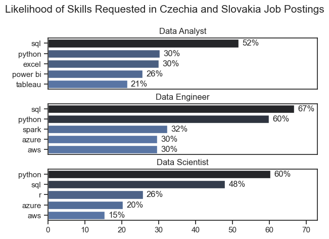
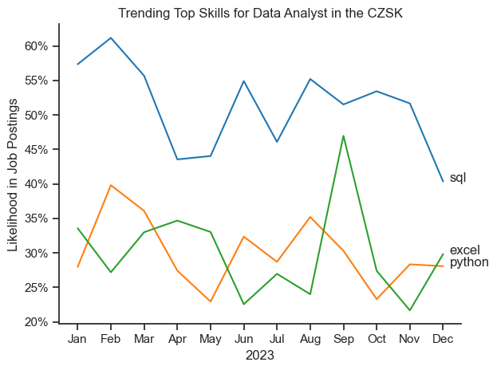
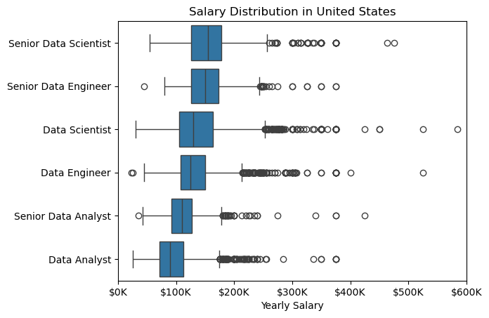
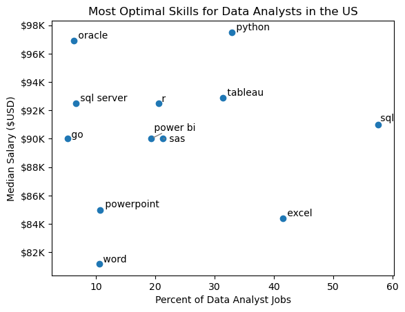
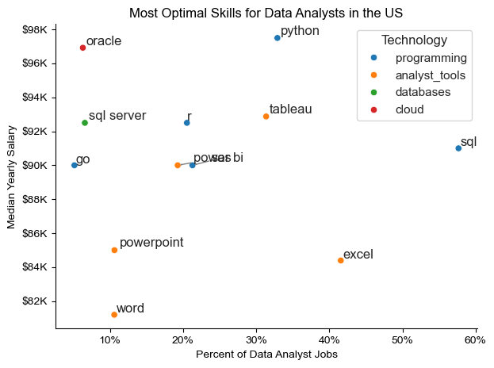

# Project Background

Welcome to my analysis of the data job market, focused on Data Analyst roles. This project was driven by a personal goal to better understand job trends and skill demand in the analytics field. One limitation of the dataset is the limited availability of salary information in Czechia and Slovakia. This may be influenced by cultural factors in the region, where salary discussions are generally considered private and not commonly shared in the workplace.

The dataset, provided through [Luke Barousse's Python Course](https://lukebarousse.com/python), contains job postings from a few years ago, including information on job titles, salaries for US, locations, and required skills. While the data is not current (2023), the analysis still offers valuable insights into market dynamics and helps build a strong foundation for future exploration.

# ⁉️Areas of Exploration

1. Analyzing the top in-demand skills across the three most common data roles.

2. Tracking trends in skill demand specific to Data Analyst positions.

3. Evaluating how different skills align with salary levels, based on available data (US).

4. Highlighting high-impact skills that combine strong demand with higher earning potential (US).

# ⚙️ Toolset Overview

To explore the Data Analyst job market in depth, I relied on a set of essential tools and technologies:

- **Python** was at the core of my analysis, helping me process data and uncover key insights. I used several powerful libraries:
  - **Pandas** – for data cleaning, transformation, and analysis.
  - **Matplotlib** – to create visualizations and better understand trends.
  - **Seaborn** – to enhance visuals with more advanced and appealing charts.

- **Jupyter Notebook** provided a convenient environment to write and run my Python code, while also documenting my thought process alongside the results.

- **Visual Studio Code** served as my main editor for writing and testing scripts outside of the notebook.

- **Git & GitHub** were essential for version control and sharing my work, making collaboration and progress tracking easy and transparent.


# 🧹 Data Preparation and Cleanup

Before diving into the analysis, it's essential to ensure that the data is clean, consistent, and ready for exploration. This section outlines the initial steps taken to load and prepare the dataset for meaningful insights.

## Importing and Cleaning the Data

I start by importing the required libraries and loading the dataset. After that, I carry out the initial cleaning steps—handling missing values, standardizing formats, and removing duplicates—to make sure the data is accurate, consistent, and ready for analysis.

```python
#importing libraries
import pandas as pd
import seaborn as sns
from datasets import load_dataset
import matplotlib.pyplot as plt
import ast

#loading data
dataset = load_dataset("lukebarousse/data_jobs")
df = dataset['train'].to_pandas()

#data cleaning
df['job_posted_date'] = pd.to_datetime(df['job_posted_date'])
df['job_skills'] = df['job_skills'].apply(lambda x: ast.literal_eval(x) if pd.notna(x) else x)

```

## Filtering Czechia and Slovakia-Based Roles

To focus my analysis on the Czechia and Slovakia job market, I apply filters to the dataset, narrowing down to roles based in the United States.

```python
df_CZ = df[df['job_country']=='Czechia'].copy()
df_SK = df[df['job_country']=='Slovakia'].copy()

#replacing inconsistent values
df_CZ['job_location'] = df_CZ['job_location'].replace({'Czechia': 'Czechia Remote', 'Anywhere': 'Czechia Remote'})

df_SK['job_location'] = df_SK['job_location'].replace({'Slovakia': 'Slovakia Remote', 'Anywhere': 'Slovakia Remote'})

#concatinating the dataframes
df_CZSK = pd.concat([df_CZ, df_SK], ignore_index=True)

```

# 🔍 The Analysis

Each notebook in this project takes a closer look at different aspects of the data job market. Here's how I approached and explored each question step by step.


## 1. Most In-Demand Skills for Top Data Roles

To understand which skills are most valued in the data job market, I focused on the three most common roles. After identifying these roles based on job posting frequency, I extracted the top 5 skills associated with each. This helped reveal which technical abilities are most important depending on the specific role you're aiming for.


📘 *You can view the full notebook with detailed steps here:*  [**Skills_count_CZSK**](PyProject_1/2_Skills_count_CZSK.ipynb)

### Visualize Data

```python
fig, ax = plt.subplots(len(job_titles),1)

sns.set_theme(style='ticks')

for i, job_title in enumerate (job_titles):
    df_plot = df_skills_count[df_skills_count['job_title_short'] == job_title].head(5)
    df_plot.plot(kind='barh', x='job_skills', y='skill_count', ax=ax[i], title=job_title)
    ax[i].invert_yaxis()
    ax[i].set_ylabel('')
    ax[i].legend().set_visible(False)

fig.suptitle('Counts of Top Skills in Job Postings', fontsize=15)
fig.tight_layout(h_pad=0.5)
plt.show()

```

### Results




*A bar chart showing top 3 data roles along with their 5 most in-demand skills*

### Key Insights:

- SQL is the most consistently demanded skill across all three roles, topping the list for both Data Analysts (52%) and Data Engineers (67%), and ranking second for Data Scientists (48%). This underscores its foundational importance in data-related roles.

- Python also shows strong cross-functional demand, especially for Data Engineers (60%) and Data Scientists (60%), reaffirming its versatility for both data manipulation and machine learning tasks.

- Data Engineers are expected to possess more cloud-related and big data tools, with AWS (30%), Azure (30%), and Spark (32%) appearing prominently highlighting the infrastructure-heavy nature of this role. In contrast, Data Analysts are more often expected to be familiar with Excel (30%), Power BI (26%), and Tableau (21%), indicating an emphasis on business intelligence and reporting tools.

## 2. Tracking trends in skill demand specific to Data Analyst positions

To explore how demand for specific skills shifted over the year, I filtered job postings for Data Analyst positions and grouped the associated skills by posting month. This approach highlights the top 5 skills for each month, offering a clear view of changing priorities in the job market throughout 2023.

📘 *See the full process in the notebook:* [**Skills Trend Analysis Notebook**](PyProject_1/3_Skills_trend_CZSK.ipynb)

### Visualize Data

```python

df_plot = df_DA_CZSK_percent.iloc[:,:3]

sns.lineplot(data = df_plot, dashes=False, palette='tab10')
sns.set_theme(style='ticks')
plt.xlabel('2023')
plt.ylabel('Likelihood in Job Postings')
plt.title('Trending Top Skills for Data Analyst in the CZSK')
plt.legend().remove()
sns.despine()

from matplotlib.ticker import PercentFormatter
ax = plt.gca()
ax.yaxis.set_major_formatter(PercentFormatter(decimals=0))

for i in range(3):
    plt.text(11.2, df_plot.iloc[-1, i], df_plot.columns[i])

plt.tight_layout()
plt.show()

```

### Results



*Graph illustrating monthly trends in key skills for data analyst positions across Czechia and Slovakia in 2023.*

### Key Insights:

- SQL dominates consistently as the top skill throughout 2023, though it shows notable volatility. Despite a dip in Q4, it remains a core requirement for data analyst roles in the region.

- Excel exhibits a sharp spike in September, suggesting seasonal or reporting-driven demand, potentially tied to budgeting or end-of-quarter activities.

- Python remains relatively stable across the year, though its demand slightly lags behind Excel and SQL. Its consistent presence indicates it's still a valuable skill, especially for automation and data processing tasks.

## 3. Evaluating how different skills align with salary levels, based on available data (US)

To uncover which roles and skills command the highest salaries, I focused on job postings from the United States and analyzed their median salaries. I began by examining salary distributions for common roles - **Data Scientist**, **Data Engineer**, and **Data Analyst** - to understand which positions tend to offer the most competitive pay.

📘 *Detailed analysis available in the notebook:* [4_Salary_Analysis](PyProject_1/4.Salary_analysis.ipynb)

#### Visualize Data 

```python

sns.boxplot(df_US_top6, x='salary_year_avg', y='job_title_short', order = job_order)

plt.xlabel('Yearly Salary')
plt.ylabel('')
plt.title('Salary Distribution in United States')
ax = plt.gca()
ax.xaxis.set_major_formatter(plt.FuncFormatter(lambda x, pos: f'${int(x/1000)}K'))

plt.xlim(0, 600000)
plt.show()

```

#### Results



*Salary distribution across six major data job titles in the U.S., shown as a box plot.*

#### Key Insights:

- Clear Hierarchy in Compensation: There’s a distinct upward trend in salaries with increased seniority and specialization. Senior Data Scientist and Senior Data Engineer roles sit at the top of the salary spectrum, indicating that advanced expertise and leadership in data domains are highly valued.

- Wide Salary Ranges for Senior Roles: The Senior Data Scientist and Senior Data Engineer positions exhibit not only high median salaries but also wide interquartile ranges (IQR) and a large number of outliers on the upper end. This suggests substantial variability in compensation, possibly influenced by factors like company size, location, and individual expertise.

- Stable and Predictable Analyst Salaries: Data Analyst and Senior Data Analyst positions show narrower distributions with fewer high-end outliers. This indicates more standardized pay across the industry for these roles, with limited spikes in compensation.

- Engineers vs Scientists: While both engineering and science roles are well-compensated, the data suggests that Data Scientists (especially at the senior level) may have a slight edge in terms of upper salary limits hinting at strong demand for advanced analytical and machine learning skills.

- Outliers Indicate High Potential: The presence of salaries beyond $400K,  even for mid-level roles like Data Scientist and Data Engineer, indicates that professionals in these positions can achieve very high earnings under certain conditions (e.g. working at top-tier tech firms or in niche areas).

- Data Analyst Entry Point: With the lowest median and overall salary range, the Data Analyst role remains the most common entry point into the data profession. However, it offers a clear growth path into more lucrative roles as skills and responsibilities increase.

### Highest Paid & Most Demanded Skills for Data Analysts

I then narrowed my analysis to focus exclusively on Data Analyst roles. Specifically, I explored which skills are most in demand and which are associated with the highest salaries. To illustrate these insights, I used two separate bar charts.

#### Visualize Data

```python

fig, ax = plt.subplots(2, 1)  

# Top 10 Highest Paid Skills for Data Analysts
sns.barplot(data=df_DA_top_pay, x='median', y=df_DA_top_pay.index, hue='median', ax=ax[0], palette='dark:b_r')

# Top 10 Most In-Demand Skills for Data Analysts')
sns.barplot(data=df_DA_skills, x='median', y=df_DA_skills.index, hue='median', ax=ax[1], palette='light:b')

plt.show()

```

#### Results
Below is an overview of the top-paying and most sought-after skills for Data Analysts in the U.S.:


*Visual comparison of the most in-demand and highest-paying skills for U.S. Data Analysts using two bar charts.*

#### Insights:

- The top graph reveals that specialized technical skills such as dplyr, Bitbucket, and GitLab are linked to higher salaries, some exceeding $200K. This suggests that advanced technical expertise can significantly boost earning potential.

- The bottom graph highlights the most in-demand skills, including Excel, PowerPoint, and SQL. While these foundational tools may not command the highest salaries, they are essential for employability and remain widely requested in job postings.

- Overall, there’s a clear distinction between the skills that offer the highest pay and those that are most sought after. To maximize career growth, data analysts should aim to build a balanced skill set that combines in-demand core tools with high-value technical proficiencies.

## 4. Highlighting high-impact skills that combine strong demand with higher earning potential (US)

To identify the most optimal skills to learn, those that are both highly paid and in high demand, I calculated the percentage of job postings requiring each skill and their corresponding median salaries. This helped highlight which skills offer the best balance of market demand and earning potential.

📘 *Explore the detailed steps in my notebook:* [5_Optimal_Skills](PyProject_1/5_Optimal_Skills.ipynb)

#### Visualize Data

```python
from adjustText import adjust_text
import matplotlib.pyplot as plt

plt.scatter(df_DA_skills_high_demand['skill_percent'], df_DA_skills_high_demand['median_salary'])
plt.show()

```

#### Results



*A scatter plot visualizing the most optimal skills (high paying & high demand) for data analysts in the US.*

#### Insights:

- The skill `Oracle` appears to have the highest median salary of nearly $97K, despite being less common in job postings. This suggests a high value placed on specialized database skills within the data analyst profession.

- More commonly required skills like `Excel` and `SQL` have a large presence in job listings but lower median salaries compared to specialized skills like `Python` and `Tableau`, which not only have higher salaries but are also moderately prevalent in job listings.

- Skills such as `Python`, `Tableau`, and `SQL Server` are towards the higher end of the salary spectrum while also being fairly common in job listings, indicating that proficiency in these tools can lead to good opportunities in data analytics.

### Visualizing Different Techonologies

Let's visualize the different technologies as well in the graph. We'll add color labels based on the technology (e.g., {Programming: Python})

#### Visualize Data

```python
from matplotlib.ticker import PercentFormatter

# Create a scatter plot
scatter = sns.scatterplot(
    data=df_DA_skills_tech_high_demand,
    x='skill_percent',
    y='median_salary',
    hue='technology',  # Color by technology
    palette='bright',  # Use a bright palette for distinct colors
    legend='full'  # Ensure the legend is shown
)
plt.show()

```

#### Results



*A scatter plot visualizing the most optimal skills (high paying & high demand) for data analysts in the US with color labels for technology.*

#### Insights:

- The scatter plot shows that most of the `programming` skills (colored blue) tend to cluster at higher salary levels compared to other categories, indicating that programming expertise might offer greater salary benefits within the data analytics field.

- The database skills (colored orange), such as Oracle and SQL Server, are associated with some of the highest salaries among data analyst tools. This indicates a significant demand and valuation for data management and manipulation expertise in the industry.

- Analyst tools (colored green), including Tableau and Power BI, are prevalent in job postings and offer competitive salaries, showing that visualization and data analysis software are crucial for current data roles. This category not only has good salaries but is also versatile across different types of data tasks.

# What I Learned

Throughout this project, I deepened my understanding of the data analyst job market and enhanced my technical skills in Python, especially in data manipulation and visualization. Here are a few specific things I learned:

- **Advanced Python Usage**: Utilizing libraries such as Pandas for data manipulation, Seaborn and Matplotlib for data visualization, and other libraries helped me perform complex data analysis tasks more efficiently.
- **Data Cleaning Importance**: I learned that thorough data cleaning and preparation are crucial before any analysis can be conducted, ensuring the accuracy of insights derived from the data.
- **Strategic Skill Analysis**: The project emphasized the importance of aligning one's skills with market demand. Understanding the relationship between skill demand, salary, and job availability allows for more strategic career planning in the tech industry.


# Insights

This project provided several general insights into the data job market for analysts:

- **Skill Demand and Salary Correlation**: There is a clear correlation between the demand for specific skills and the salaries these skills command. Advanced and specialized skills like Python and Oracle often lead to higher salaries.
- **Market Trends**: There are changing trends in skill demand, highlighting the dynamic nature of the data job market. Keeping up with these trends is essential for career growth in data analytics.
- **Economic Value of Skills**: Understanding which skills are both in-demand and well-compensated can guide data analysts in prioritizing learning to maximize their economic returns.


# Challenges I Faced

This project was not without its challenges, but it provided good learning opportunities:

- **Data Inconsistencies**: Handling missing or inconsistent data entries requires careful consideration and thorough data-cleaning techniques to ensure the integrity of the analysis.
- **Complex Data Visualization**: Designing effective visual representations of complex datasets was challenging but critical for conveying insights clearly and compellingly.
- **Balancing Breadth and Depth**: Deciding how deeply to dive into each analysis while maintaining a broad overview of the data landscape required constant balancing to ensure comprehensive coverage without getting lost in details.


# Conclusion

This exploration into the data analyst job market has been incredibly informative, highlighting the critical skills and trends that shape this evolving field. The insights I got enhance my understanding and provide actionable guidance for anyone looking to advance their career in data analytics. As the market continues to change, ongoing analysis will be essential to stay ahead in data analytics. This project is a good foundation for future explorations and underscores the importance of continuous learning and adaptation in the data field.