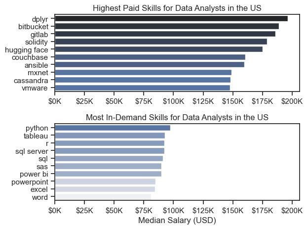

# Project Background

Welcome to my exploration of the data job market, with a particular focus on Data Analyst roles. This project was inspired by a personal goal: to better understand the trends, opportunities, and in-demand skills shaping the analytics profession.

The dataset used for this analysis comes from [Luke Barousse's Python Course](https://lukebarousse.com/python) and includes job postings collected a few years ago. It provides valuable information on job titles, required skills, locations, and salary data though salary figures are mostly available for positions in the United States. One notable limitation is the limited availability of salary data for Czechia and Slovakia, which restricts regional comparisons.

Although the dataset is not up to date (the latest data is from around 2023), it still offers meaningful insights into broader market patterns and skill demand. This analysis serves as a strong starting point for anyone looking to understand the data analytics landscape and lays the groundwork for more targeted and current investigations in the future.

# ⁉️Areas of Exploration

1. Analyzing the top in-demand skills across the three most common data roles.

2. Tracking trends in skill demand specific to Data Analyst positions.

3. Evaluating how different skills align with salary levels, based on available data (US).

4. Highlighting high-impact skills that combine strong demand with higher earning potential (US).

# ⚙️ Toolset Overview

To explore the Data Analyst job market in depth, I relied on a set of essential tools and technologies:

- **Python** was at the core of my analysis, helping me process data and uncover key insights. I used several powerful libraries:
  - **Pandas** – for data cleaning, transformation, and analysis.
  - **Matplotlib** – to create visualizations and better understand trends.
  - **Seaborn** – to enhance visuals with more advanced and appealing charts.

- **Jupyter Notebook** provided a convenient environment to write and run my Python code, while also documenting my thought process alongside the results.

- **Visual Studio Code** served as my main editor for writing and testing scripts outside of the notebook.

- **Git & GitHub** were essential for version control and sharing my work, making collaboration and progress tracking easy and transparent.


# 🧹 Data Preparation and Cleanup

Before diving into the analysis, it's essential to ensure that the data is clean, consistent, and ready for exploration. This section outlines the initial steps taken to load and prepare the dataset for meaningful insights.

## Importing and Cleaning the Data

I start by importing the required libraries and loading the dataset. After that, I carry out the initial cleaning steps, handling missing values, standardizing formats, and removing duplicates to make sure the data is accurate, consistent, and ready for analysis.

```python
#importing libraries
import pandas as pd
import seaborn as sns
from datasets import load_dataset
import matplotlib.pyplot as plt
import ast

#loading data
dataset = load_dataset("lukebarousse/data_jobs")
df = dataset['train'].to_pandas()

#data cleaning
df['job_posted_date'] = pd.to_datetime(df['job_posted_date'])
df['job_skills'] = df['job_skills'].apply(lambda x: ast.literal_eval(x) if pd.notna(x) else x)

```

## Filtering Czechia and Slovakia-Based Roles

To focus my analysis on the Czechia and Slovakia job market, I apply filters to the dataset, narrowing down to roles based in the United States.

```python
df_CZ = df[df['job_country']=='Czechia'].copy()
df_SK = df[df['job_country']=='Slovakia'].copy()

#replacing inconsistent values
df_CZ['job_location'] = df_CZ['job_location'].replace({'Czechia': 'Czechia Remote', 'Anywhere': 'Czechia Remote'})

df_SK['job_location'] = df_SK['job_location'].replace({'Slovakia': 'Slovakia Remote', 'Anywhere': 'Slovakia Remote'})

#concatinating the dataframes
df_CZSK = pd.concat([df_CZ, df_SK], ignore_index=True)

```

# 🔍 The Analysis

Each notebook in this project takes a closer look at different aspects of the data job market. Here's how I approached and explored each question step by step.


## 1. Most In-Demand Skills for Top Data Roles

To understand which skills are most valued in the data job market, I focused on the three most common roles. After identifying these roles based on job posting frequency, I extracted the top 5 skills associated with each. This helped reveal which technical abilities are most important depending on the specific role you're aiming for.


📘 *You can view the full notebook with detailed steps here:*  [**Skills_count_CZSK**](PyProject_1/2_Skills_count_CZSK.ipynb)

### Visualize Data

```python
fig, ax = plt.subplots(len(job_titles),1)

sns.set_theme(style='ticks')

for i, job_title in enumerate (job_titles):
    df_plot = df_skills_count[df_skills_count['job_title_short'] == job_title].head(5)
    df_plot.plot(kind='barh', x='job_skills', y='skill_count', ax=ax[i], title=job_title)
    ax[i].invert_yaxis()
    ax[i].set_ylabel('')
    ax[i].legend().set_visible(False)

fig.suptitle('Counts of Top Skills in Job Postings', fontsize=15)
fig.tight_layout(h_pad=0.5)
plt.show()

```

### Results


*A bar chart showing top 3 data roles along with their 5 most in-demand skills*

### Key Insights:

- `SQL` is the most consistently demanded skill across all three roles, topping the list for both Data Analysts (52%) and Data Engineers (67%), and ranking second for Data Scientists (48%). This underscores its foundational importance in data-related roles.

- `Python` also shows strong cross-functional demand, especially for Data Engineers (60%) and Data Scientists (60%), reaffirming its versatility for both data manipulation and machine learning tasks.

- Data Engineers are expected to possess more cloud-related and big data tools, with `AWS` (30%), `Azure` (30%), and `Spark` (32%) appearing prominently highlighting the infrastructure-heavy nature of this role. In contrast, Data Analysts are more often expected to be familiar with `Excel` (30%), `Power BI` (26%), and `Tableau` (21%), indicating an emphasis on business intelligence and reporting tools.

## 2. Tracking trends in skill demand specific to Data Analyst positions

To explore how demand for specific skills shifted over the year, I filtered job postings for Data Analyst positions and grouped the associated skills by posting month. This approach highlights the top 5 skills for each month, offering a clear view of changing priorities in the job market throughout 2023.

📘 *See the full process in the notebook:* [**Skills Trend Analysis Notebook**](PyProject_1/3_Skills_trend_CZSK.ipynb)

### Visualize Data

```python

df_plot = df_DA_CZSK_percent.iloc[:,:3]

sns.lineplot(data = df_plot, dashes=False, palette='tab10')
sns.set_theme(style='ticks')
plt.xlabel('2023')
plt.ylabel('Likelihood in Job Postings')
plt.title('Trending Top Skills for Data Analyst in the CZSK')
plt.legend().remove()
sns.despine()

from matplotlib.ticker import PercentFormatter
ax = plt.gca()
ax.yaxis.set_major_formatter(PercentFormatter(decimals=0))

for i in range(3):
    plt.text(11.2, df_plot.iloc[-1, i], df_plot.columns[i])

plt.tight_layout()
plt.show()

```

### Results


*Graph illustrating monthly trends in key skills for data analyst positions across Czechia and Slovakia in 2023.*

### Key Insights:

- `SQL` dominates consistently as the top skill throughout 2023, though it shows notable volatility. Despite a dip in Q4, it remains a core requirement for data analyst roles in the region.

- `Excel` exhibits a sharp spike in September, suggesting seasonal or reporting-driven demand, potentially tied to budgeting or end-of-quarter activities.

- `Python` remains relatively stable across the year, though its demand slightly lags behind `Excel` and `SQL`. Its consistent presence indicates it's still a valuable skill, especially for automation and data processing tasks.

## 3. Evaluating how different skills align with salary levels, based on available data (US)

To uncover which roles and skills command the highest salaries, I focused on job postings from the United States and analyzed their median salaries. I began by examining salary distributions for common roles - **Data Scientist**, **Data Engineer**, and **Data Analyst** - to understand which positions tend to offer the most competitive pay.

📘 *Detailed analysis available in the notebook:* [4_Salary_Analysis](PyProject_1/4.Salary_analysis.ipynb)

#### Visualize Data 

```python

sns.boxplot(df_US_top6, x='salary_year_avg', y='job_title_short', order = job_order)

plt.xlabel('Yearly Salary')
plt.ylabel('')
plt.title('Salary Distribution in United States')
ax = plt.gca()
ax.xaxis.set_major_formatter(plt.FuncFormatter(lambda x, pos: f'${int(x/1000)}K'))

plt.xlim(0, 600000)
plt.show()

```

#### Results


*Salary distribution across six major data job titles in the U.S., shown as a box plot.*

#### Key Insights:

- Clear Hierarchy in Compensation: There’s a distinct upward trend in salaries with increased seniority and specialization. Senior Data Scientist and Senior Data Engineer roles sit at the top of the salary spectrum, indicating that advanced expertise and leadership in data domains are highly valued.

- Wide Salary Ranges for Senior Roles: The Senior Data Scientist and Senior Data Engineer positions exhibit not only high median salaries but also wide interquartile ranges (IQR) and a large number of outliers on the upper end. This suggests substantial variability in compensation, possibly influenced by factors like company size, location, and individual expertise.

- Stable and Predictable Analyst Salaries: Data Analyst and Senior Data Analyst positions show narrower distributions with fewer high-end outliers. This indicates more standardized pay across the industry for these roles, with limited spikes in compensation.

- Engineers vs Scientists: While both engineering and science roles are well-compensated, the data suggests that Data Scientists (especially at the senior level) may have a slight edge in terms of upper salary limits hinting at strong demand for advanced analytical and machine learning skills.

- Outliers Indicate High Potential: The presence of salaries beyond $400K,  even for mid-level roles like Data Scientist and Data Engineer, indicates that professionals in these positions can achieve very high earnings under certain conditions (e.g. working at top-tier tech firms or in niche areas).

- Data Analyst Entry Point: With the lowest median and overall salary range, the Data Analyst role remains the most common entry point into the data profession. However, it offers a clear growth path into more lucrative roles as skills and responsibilities increase.

### Highest Paid & Most Demanded Skills for Data Analysts

I then narrowed the analysis to focus solely on Data Analyst roles, examining which skills are most in demand and which correlate with the highest salaries. To present these insights clearly, I created two separate bar charts.

#### Visualize Data

```python

fig, ax = plt.subplots(2, 1)  

# Top 10 Highest Paid Skills for Data Analysts
sns.barplot(data=df_DA_top_pay, x='median', y=df_DA_top_pay.index, hue='median', ax=ax[0], palette='dark:b_r')

# Top 10 Most In-Demand Skills for Data Analysts')
sns.barplot(data=df_DA_skills, x='median', y=df_DA_skills.index, hue='median', ax=ax[1], palette='light:b')

plt.show()

```

#### Results
Here’s a look at the top-paying and most in-demand skills for Data Analysts in the U.S.:



*Visual comparison of the most in-demand and highest-paying skills for U.S. Data Analysts using two bar charts.*

#### Key Insights:

- The top graph reveals that specialized technical skills such as `dplyr`, `Bitbucket`, and `GitLab` are linked to higher salaries, some exceeding $200K. This suggests that advanced technical expertise can significantly boost earning potential.

- The bottom graph highlights the most in-demand skills, including `Excel`, `PowerPoint`, and `SQL`. While these foundational tools may not command the highest salaries, they are essential for employability and remain widely requested in job postings.

- Overall, there’s a clear distinction between the skills that offer the highest pay and those that are most sought after. To maximize career growth, data analysts should aim to build a balanced skill set that combines in-demand core tools with high-value technical proficiencies.

## 4. Highlighting high-impact skills that combine strong demand with higher earning potential (US)

To find the most valuable skills to learn, those that are both well-paid and in high demand, I calculated the percentage of job postings mentioning each skill along with their median salaries. This helped reveal which skills offer the best balance between market demand and earning potential.

📘 *Explore the detailed steps in my notebook:* [5_Optimal_Skills](PyProject_1/5_Optimal_Skills.ipynb)

#### Visualize Data

```python
from adjustText import adjust_text
import matplotlib.pyplot as plt

plt.scatter(df_DA_skills_high_demand['skill_percent'], df_DA_skills_high_demand['median_salary'])
plt.show()

```

#### Results


*A scatter plot showing the most valuable skills for Data Analysts in the U.S., those that offer both high pay and strong demand.*

#### Key Insights:

- `Oracle` stands out with the highest median salary (~$97K) despite its relatively low presence in job postings. This suggests that niche, enterprise-level database skills are highly valued, likely due to their complexity and limited talent pool.

- `Python`, `Tableau`, and `SQL Server` strike an ideal balance between market demand and salary potential. Their positions in the top-right quadrant indicate that these tools are not only commonly required but also well-compensated. For aspiring or current analysts, investing in these skills could yield high returns.

- Tools like `Excel` and `SQL` dominate job postings, particularly `SQL`, which appears in nearly 60% of listings. However, their median salaries are lower relative to more specialized skills. This reflects their status as foundational tools, essential, but not differentiators.

### Visualizing Different Techonologies

Let’s also visualize the different types of technologies in the graph by adding color labels based on their category (e.g., Programming: Python).

#### Visualize Data

```python
from matplotlib.ticker import PercentFormatter

# Create a scatter plot
scatter = sns.scatterplot(
    data=df_DA_skills_tech_high_demand,
    x='skill_percent',
    y='median_salary',
    hue='technology',  # Color by technology
    palette='bright',  # Use a bright palette for distinct colors
    legend='full'  # Ensure the legend is shown
)
plt.show()

```

#### Results


*A scatter plot highlighting the most valuable skills for Data Analysts in the U.S., those that offer both high pay and strong demand, enhanced with color-coded labels by technology type.*

#### Key Insights:

- Skills in the *programming* category (🔵), such as `Python`, `R`, and `Go`, are generally associated with higher median salaries. This suggests that programming proficiency is a high-value asset in the data analytics field, especially for roles involving scripting, automation, or advanced analytics.

- *Database* technologies (🟢), including `Oracle` and `SQL Server`, command some of the highest salaries despite being less frequently mentioned in job postings. This highlights their specialized nature and the premium placed on professionals with strong data management capabilities.

- Tools in the *analyst_tools* category (🟠), such as `Excel`, `PowerPoint`, and `Word`, are more commonly listed but tend to offer lower median salaries. These tools are often considered foundational rather than differentiators, though `Tableau` and `Power BI` stand out by offering both solid salaries and strong demand.

- Tools like `Tableau` and `Power BI` strike a favorable balance, frequently required in job postings and offering competitive salaries. Their utility in reporting and dashboarding workflows makes them essential across industries.

# 🎓 What I Learned

This project provided a valuable opportunity to deepen my understanding of the data analyst job market while enhancing my technical proficiency in Python, particularly in data wrangling and visualization. Key lessons from this analysis include:

- **Proficient Use of Python for Data Analysis**: I refined my skills in leveraging core Python libraries such as **Pandas** for data manipulation, **Seaborn** and **Matplotlib** for effective data visualization. These tools enabled me to explore, analyze, and communicate insights from complex datasets with greater confidence and efficiency.

- **The Critical Role of Data Cleaning**: One of the most important takeaways was the significance of rigorous data cleaning. Preparing the dataset, resolving inconsistencies, handling missing values, and standardizing formats, proved to be an essential step in ensuring the reliability and validity of the analysis.

- **Market-Driven Skill Evaluation**: The project highlighted the strategic value of understanding how technical skills map to market trends. Analyzing the correlation between specific tools, job availability, and salary levels helped me appreciate the importance of aligning my skillset with industry demand to make informed decisions about professional growth.


# 📊 Key Insights

This project uncovered several valuable insights into the data analyst job market:

- **Correlation Between Skill Demand and Salary**: The analysis revealed a strong link between the demand for certain technical skills and the salaries they command. In particular, proficiency in advanced tools like **Python**, **SQL**, and **Oracle** is often associated with higher compensation, underscoring the market value of specialized expertise.

- **Shifting Market Trends**: The demand for specific skills evolves over time, reflecting broader changes in technology and business needs. Staying current with these trends is crucial for maintaining a competitive edge and identifying emerging areas of opportunity in the data analytics field.

- **Skills as Economic Assets**: Recognizing which skills are both highly sought-after and well-paid can help analysts make more strategic decisions about where to invest their time and learning efforts. Prioritizing the development of such skills can significantly enhance one’s long-term career and earning potential.


# ⚙️ Navigating Project Hurdles

Throughout the course of this analysis, I encountered several obstacles that ultimately served as valuable learning experiences:

- **Ensuring Data Reliability**: One of the core difficulties was addressing irregularities within the dataset—ranging from missing values to inconsistent formats. This required a methodical approach to data preprocessing to maintain analytical accuracy and avoid misleading conclusions.

- **Crafting Intuitive Visual Narratives**: Translating multidimensional data into clear and impactful visuals proved to be a complex task. It demanded not only technical fluency with visualization libraries but also an eye for design and storytelling to ensure that findings were accessible and informative.

- **Maintaining Analytical Focus**: Striking the right balance between a high-level overview and deep, focused analysis was an ongoing challenge. It required careful prioritization to ensure that insights were both meaningful and grounded in the broader context of the dataset.

# 🧩 Final Reflections

This project offered a meaningful deep dive into the evolving landscape of data analyst roles, shedding light on the skills, tools, and trends that define success in the field. The findings not only broadened my perspective but also provided practical insights for navigating a competitive and rapidly changing job market.

As data continues to drive decision-making across industries, staying aligned with market needs and technological developments becomes increasingly important. This analysis serves as a solid starting point for ongoing exploration and highlights the value of continuous learning, strategic upskilling, and adaptability in the data profession.